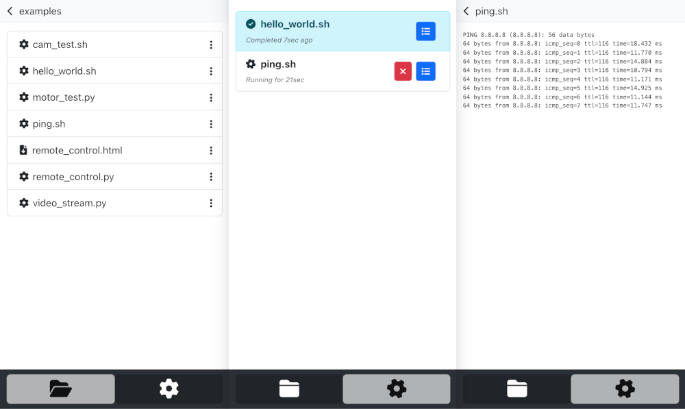

# RunBerry

**RunBerry** is a web interface for running executables on your Raspberry Pi. It allows you to browse your filesystem, select an executable, and run it. The output of the executable will be displayed in the browser. You can also manage the running processes and stop them if needed. The user interface is optimized for mobile devices, so you can control your Raspberry Pi from your phone or tablet.



## Key Features
- Browse your filesystem
- Run executables (with custom arguments)
- View logs and output
- Manage running processes
- Download files

## Installation

To install **RunBerry**, run the following command on your Raspberry Pi:

```bash
curl -fsSL https://raw.githubusercontent.com/jamro/CodeCruiser/refs/heads/main/installer.sh | bash
```

This will download and install **RunBerry** on your Raspberry Pi. Once the installation is complete, you can access the web interface by navigating to `http://<your_raspberry_pi_ip>` in your browser.

All files will be installed in the `/home/pi/CodeCruiser/runberry` directory. Files available through the web interface will be located in the `/home/pi/CodeCruiser/workspace` directory. It contains `examples` directory with some example executables that you can try.

All the commands are execured as root user. The web interface is running on port 80, so you don't need to specify the port in the URL.

## System Tools

**RunBerry** comes with a set of system tools located in the `/home/pi/CodeCruiser/workspace/system` directory. These tools allow you to perform various tasks on your Raspberry Pi:

- `sys_update.sh` - Update the system and install the latest version of **RunBerry**.
- `bash.sh` - Run any bash command on your Raspberry Pi. Provide the command as an argument.


